# 20170426tsukubaHandson
## フォルダー構成
* src/ Azureに配置するサンプルWebアプリ [2016年名古屋](https://github.com/mspjp/20160208AzureHandsonNagoya)で行ったハンズオンで作成したものです
* src/php/basic/ PHP動作確認用Webアプリ(HelloPHPと出るだけです)
* src/php/todo/ PHP版 TODOアプリ cookieにデータを保存する版
* src/php/todo-mysql/ PHP版 TODOアプリ DBにデータを保存する版
* src/node/basic Node.js動作確認Webアプリ(Hello Nodeと出るだけです)
* src/node/chat Node.js版 チャットアプリ

## ハンズオンの内容
0. WebAppsについて  
1. WebAppsを作成しよう  
2. PHP版のWebアプリを配置してみよう -OneDrve/DropBox/FTP/Github経由でデプロイ-  
3. クォーター・管理コンソール・Webサーバーの設定変更
時間があれば以下も行います  
4. Node.js版のWebアプリを配置してみよう -WebSocketの設定-  
5. PHPとDBを使うWebアプリを配置してみよう -MySQLと連携-  

ハンズオンを始める前にこのリポジトリをクローン（わからない方は右上の「Clone or Download」から「DownloadZip」をクリックして中身を解答して保存）してください。  

## 0. AzureとWebAppsについて
### Azureとは

Microsoft社が提供するクラウド(サービスをネットワーク経由で利用する形)サービス  

仮想マシンやネットワークのインフラ、機械学習プラットフォームやストレージサービスなど様々なサービスを提供

開発者として見たクラウド(Azureに限らず)  
* インフラやプラットフォームを利用
* サーバの構築・管理などの面倒な部分はすべてお任せ  
  →開発に専念	

#### リージョン
Azureは世界各地にデータセンターを持っている(データセンターがある地域をリージョンという)  
日本は東（東京、埼玉）と西（大阪）  
リージョンごとに使える機能や料金などが異なる  
遠いリージョンだと単純に遅いので近い方がいい  

#### 料金
サービスごとに課金されるが、基本使った時間だけ  

MicrosoftImagine経由で登録した場合は無料で使える機能のみアクセス可能  
>制限を超えて使ってもあとから課金されることはないので安心  
>(ただし普通にアカウントを登録してクレジットカードと連携させて、制限をかけない場合は対象外)

### WebAppsとは  
Webサイトを簡単に公開する機能  
Webサイトを公開するのに向く  
※現在バックエンドがWindows版、Linux版がありますが、Linux版はプレビューなので
**ここではバックエンドがWindows版を対象**にします。　

以下の様なことをしたい場合は仮想マシン等を検討
* 特定のポートで待機したい
* サポートしていない言語で作りたい
* プログラムをインストルして動かしたい・ライブラリをシステムに入れる必要がある

#### 環境について(Windows版)
* 動く言語は.NET/Node.js/PHP/Java/Python  
* WindowsServerとIISで構築されている    
* Webサーバの設定は.htaccessではなくweb.configを配置  
  cakePHPなどをそのまま置くと動かない  
* コマンドを走らせたりする際はPowesShell(orCMD)  

>なお、現在Linuxインスタンスがプレビューで公開されています（Ruby対応)  
>Docker上で動くのでカスタマイズしたコンテナ上で動かすことも可能  
>※ただし4/15現在でプレビューなのでこの先どうなるかわからないです。

#### 料金プランと制限 
|プラン名|月額|アプリ数|CPU|メモリ|ストレージ|帯域制限|
|:-----:|:--:|:-----:|:--:|:---:|:-------:|:-----:|
|無料|0|10|共有 60分/日|1G|1G|165MB/日|
|共有|\1.57/時|100|共有 240分/日|0.5G|1G|無し(転送量ごとに課金)|
|Basic B1|\9.03/時|無制限|1コア|1.75G|10G|無し(転送量ごとに課金)|
|Standard S1|\12.04/時|無制限|1コア|1.75G|50G|無し(転送量ごとに課金)|
|Standard S3|\48.15/時|無制限|4コア|7G|50G|無し(転送量ごとに課金)|

アプリ数：1サーバー上で実行できるWebサイトなどの数  
CPU：60分/日は1日あたりCPU時間を60分まで利用できる  
※無料、共有プランはサーバー単位でなくアプリ単位でリソース制限・課金  
Basic,Standard,Premiumと上げていくと様々な機能が利用可能になる  

プランは任意のタイミングで変更可能（変更中数分程度ダウンタイムが発生する）  
→最初は無料プランで、必要に応じて課金することも可能

## 1. WebAppsを作成しよう
Azureのポータルサイト([http://portal.azure.com/](http://portal.azure.com/))へアクセスします

アクセスすると以下の画面になります。  
  

今回はWebサイトをホスティングするWebAppを作成するので「新規」から「Web+モバイル」、「WebApp」を選択します。  

  
  

WebAppを追加する画面が表示されます。  
  

* アプリ名  
任意です。URLになりますので他人と被らない名前にしてください。  
すでに存在する場合は が表示されます  
* サブスクリプション  
 関連付けるAzureのアカウントです。Microsoft ImaginもしくはDreamSparkが選ばれていることを確認してください。  
* リソースグループ  
新規作成を選択し、任意の名前をつけてください。  
* App Serviceプラン/場所  
AppServiceをホスティングするサーバーの場所と料金プランを選択します。  
「新規作成」を選択して「場所」を「Japan East」にすることをおすすめします。  
(価格レベルはF1 Freeのみ選択できます。なお、新規作成する場合はAppServiceプラン名に任意の名前をつけてください。)  
  

>#### リソースグループについて
>リソースグループはAzureの仮想マシン、WebApp、ネットワークなどのリソースをまとめて管理する機能です。  
>グループ化することでまとめて消したりすることが出来ます。  

  
内容を書くにして「作成」ボタンを押します。  

進捗状況は「通知」ボタンをおすことで確認できます。  
  

デプロイが完了しましたと出れば完了です。  
  

追加したWebAppにアクセスしてみましょう。  

「AppService」を選択し追加したWebAppをクリックします。  

  

「概要」に表示されるURLをクリックすることでデフォルトのページにアクセスできます。  
  

図のようなページが表示されれば完了です。  
  

## 2. PHP版のWebアプリを配置してみよう
Azureでは様々な方法でWebアプリをデプロイ出来ますが、以下3種類に大別できます。  

* 外部のサービスにソースコードを置き、手動でデプロイする場合(DropBox/OneDrive/外部リポジトリ等)  
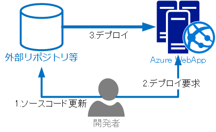  

* 外部のサービスにソースコードを置き、ソースコードを更新したタイミングで自動的にデプロイする場合（継続的なデプロイ Github/Bitbucket等）  
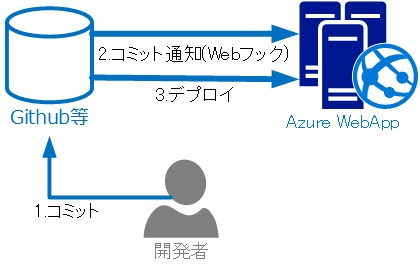  

* Azure WebAppsに直接デプロイする場合(FTP/内部リポジトリ)  
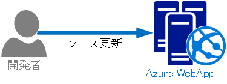  

### DropBox/OneDrive/外部リポジトリ/Github
「デプロイメント」の「デプロイオプション」を選択します。  
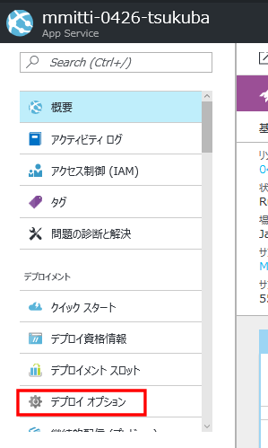    

「ソースの選択」をクリックします。  
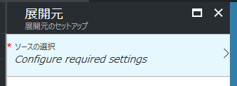  

ソースコードの同期元を選択する画面が表示されます。  
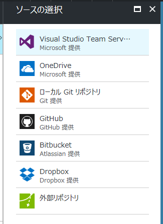  

ここからソースコードをどこから同期するかによって手順が別れます。

DropBox/OneDrive経由でデプロイする方は[こちら](#dropboxonedrive)  
外部リポジトリ経由でデプロイする方は[こちら](#外部リポジトリ)  
Githubを利用してデプロイする方は[こちら](#github)   

#### DropBox/OneDrive
基本的な操作はほぼ同じなのでここではDropBoxを例に説明します。  

「ソースの選択」から「DropBox」を選択。  

「展開元」から「承認」を選択し、「承認する」をクリック
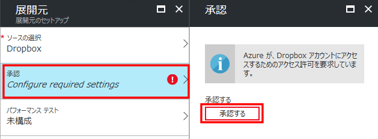  

DropBoxのログインページが表示されるのでログインする。  

ログイン完了後続行するにはOKをクリックしてくださいと表示されたら「OK」をクリック。  
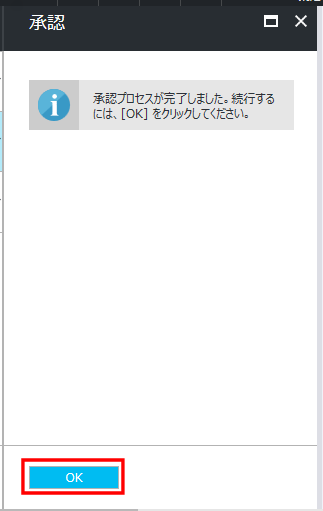    

内容を確認して「OK」をクリックします。  
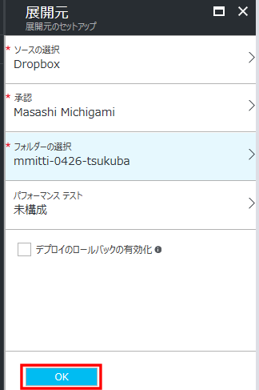  
フォルダーの選択はDropBox上で生成されるソースコードを置くフォルダーを選択します。  
（DropBoxの場合はアプリ/Azure/以下になります。）  
デプロイのロールバックの有効化にチェックを入れると、ソースコードを任意のデプロイしたタイミングに戻すことが出来ます。  

このタイミングでDropboxのアプリ/Azure/フォルダーの選択で指定したフォルダー名が作成されていると思うのでこちらを開いてください。  

開いたフォルダーにクローン・ダウンロードしたこのリポジトリのsrc/php/todoの中身をすべてコピーしてください。  
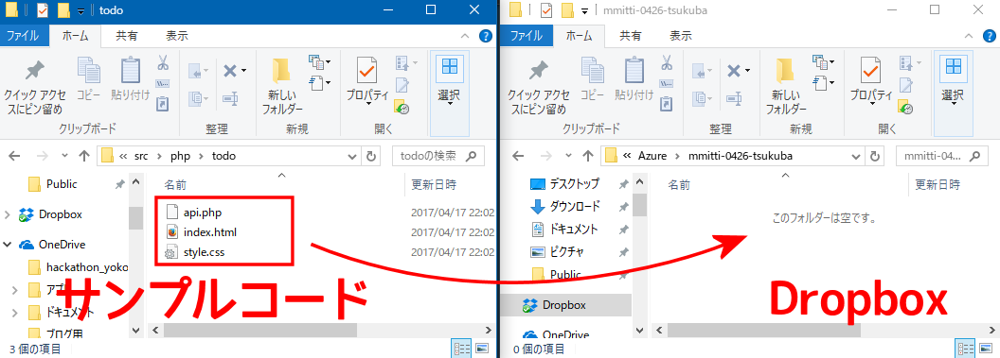  

Azureのポータルに戻り「デプロイオプション」の「同期」をクリックし
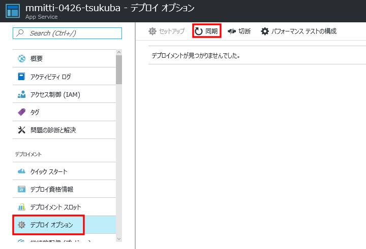    
Dropboxリポジトリのコンテンツを取得し、デプロイしますか？と聞かれるので「はい」を選択してください。  
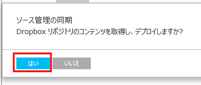  

しばらく待ってSynchronized n change(s) from Dropboxと表示されればデプロイ完了です。  
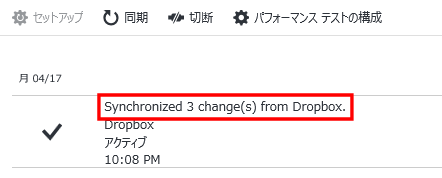  

以降ソースコードを更新し、サーバーにデプロイする際はこの手順を繰り返せばOKです。  

試しにWebAppにアクセスしてみましょう。    
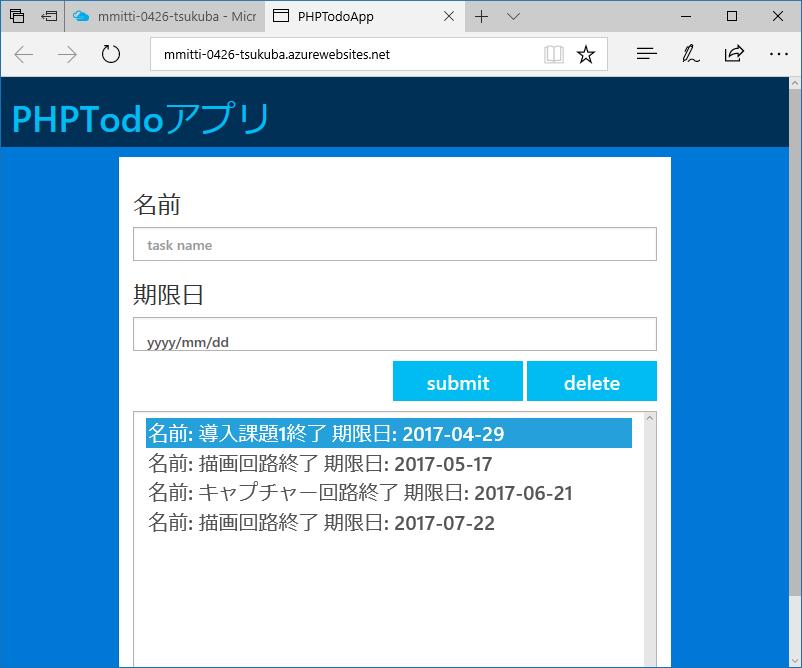   
このようにTodoアプリが表示されれば完了です。  

お好みでsrc/php/basic以下のものをコピーしてデプロイしてもOKです。  

[このまま次の章に進みましょう](#3-リソース制限ログ管理コンソール)  

#### 外部リポジトリ
「ソースの選択」から「外部リポジトリ」を選択。

リポジトリのURLにソースコードを配置するリポジトリのURL、分岐にブランチ名を入力します。  

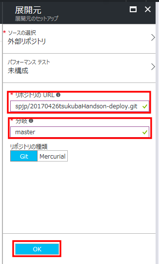  

今回、こちらでは  
URL： https://github.com/mspjp/20170426tsukubaHandson-deploy.git  
ブランチ： master  
を用意しています。  

内容を確認して「OK」ボタンを押してください。  

Azureのポータルに戻り「デプロイオプション」の「同期」をクリックし
    
External リポジトリのコンテンツを取得し、デプロイしますか？と聞かれるので「はい」を選択してください。  
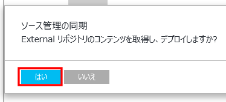  

しばらく待ってコミット名が表示されればデプロイ完了です。    
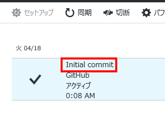  

以降ソースコードを更新・リポジトリにpush後、サーバーにデプロイする際はこの手順を繰り返せばOKです。  

試しにWebAppにアクセスしてみましょう。    
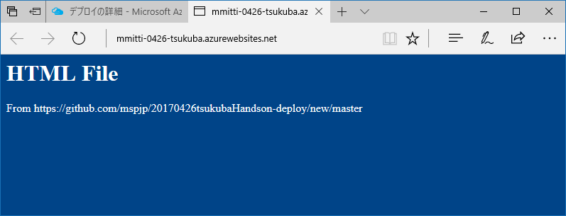   
このようにテスト用ページが表示されれば完了です。  

>#### ハンズオン用メモ
>外部リポジトリで試しにされる方が多い場合はこのあとこちらでページを更新して再度デプロイしてもらうというのを含めるかもしれません。  

[このまま次の章に進みましょう](#3-リソース制限ログ管理コンソール)  

#### Github
>こちらは今回のハンズオンでは扱いませんが、今後Azure WebAppsを利用される際に参考にしてください。  
>なお、Githubと連携させる方式が一番おすすめです。  

「ソースの選択」から「Github」を選択。  

「展開元」から「承認」を選択し、「承認する」をクリック
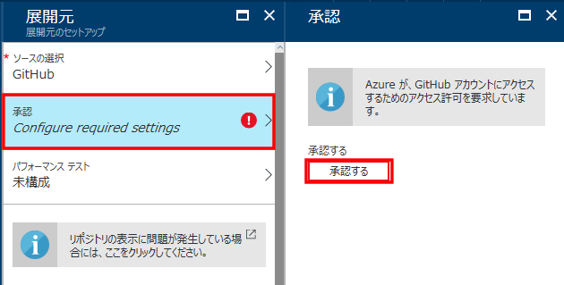  

Githubにログインします。  
  

内容を確認し「Authorize Application」をクリックします。  
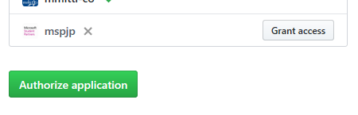  

Azureのポータルに戻りログイン完了後続行するにはOKをクリックしてくださいと表示されたら「OK」をクリック。  
    

同期元のリポジトリ・ブランチなどを指定します。  
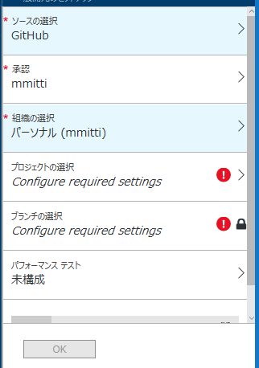  

デプロイオプション内で最新のコミットが表示されていれば成功です。  
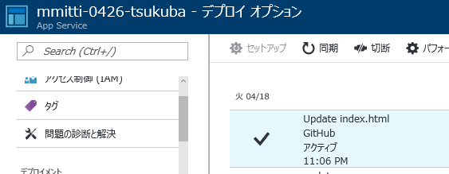  

以降Githubの該当するブランチを更新するたびに自動的にデプロイされます。    

### FTP
>こちらは今回のハンズオンでは扱いませんが、今後Azure WebAppsを利用される際に参考にしてください。  

まず、FTPのユーザーとパスワードを登録します。  
「デプロイ資格情報」をクリックし「FTP/デプロイユーザー名」と「パスワード」を登録します。  
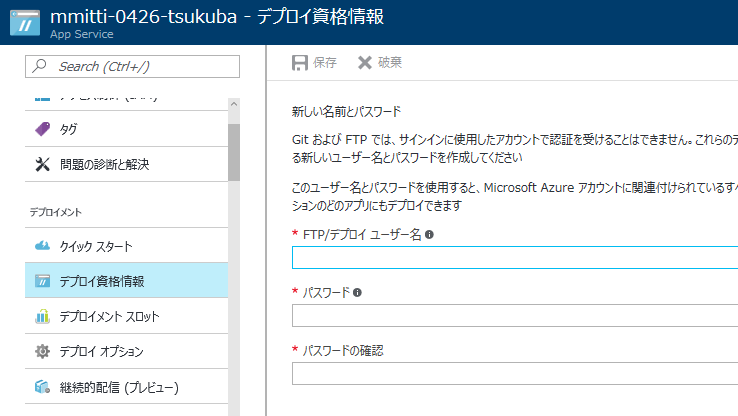  

入力後「保存」を押してください。  
つぎに「概要」からFTP(S)ホスト名を確認し、FTPクライアントやエクスプローラーなどでアクセスします。  
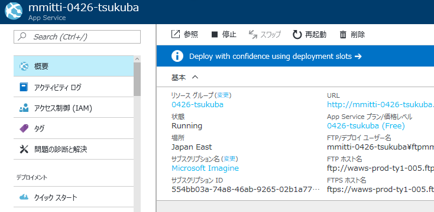  

アクセス時にIDとパスワードを要求されるので「概要」の「FTP/デプロイ ユーザー名」をIDに、パスワードは「デプロイ資格情報」で指定したものを入録してください。  

WebAppsのホームフォルダーにアクセスできます。  
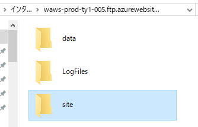  
Webに公開されるデーターはsite/wwwroot/以下になりますのでこちらにWebアプリやHTMLファイルなどをコピーしてください。  

## 3. クォーター・管理コンソール・Webサーバーの設定変更
### クォーター
無料プランなどリソース制限がある場合はあとどれだけ利用するとサイトが止まるかを確認する機能があります。  
「App Serviceプラン」の「クォータ」を選択すると一覧で表示されます。  
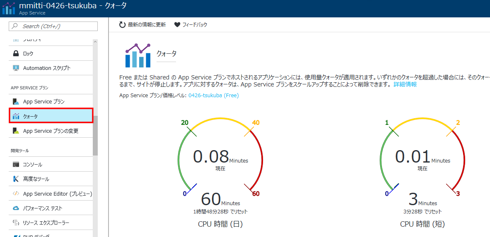  
なお、リソース制限がかかった場合はWebサイトアクセス時に403が表示されます。  
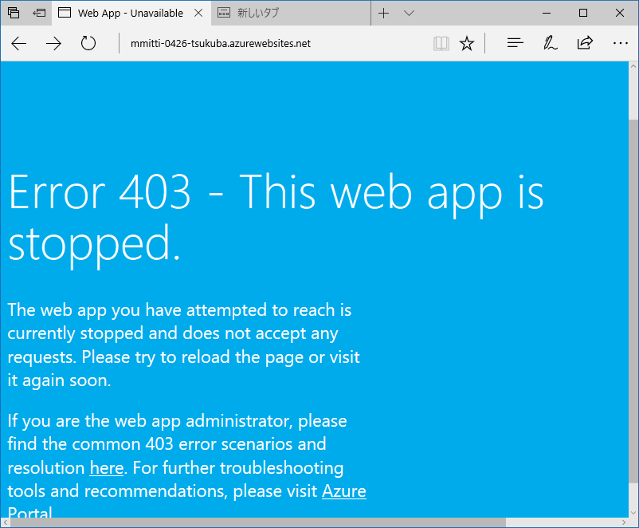  

リソース制限などでWebAppsが止まった場合は管理コンソールなどが利用できなくなります。    
(WebAppsのサーバー上で動いているAPIサーバーも止められてしまうため)  

### 管理コンソール
Webサーバーの管理用にコマンドプロンプト・PowerShellが利用できます。  
「開発ツール」の「コンソール」から利用できます。  
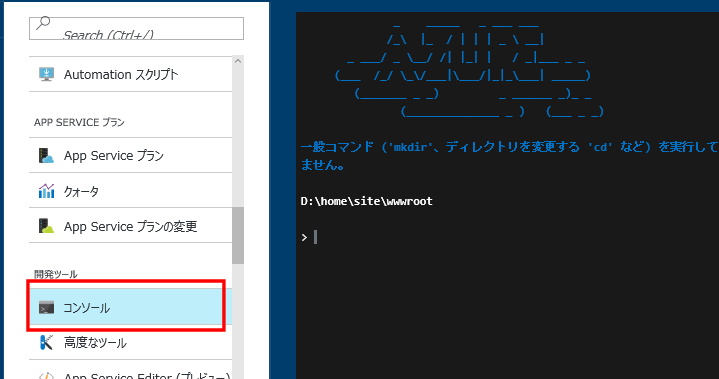  

### Webサーバーの設定変更
WebサーバーのPHPのバージョンや環境変数、ディレクトリのルーティングなどの変更は「設定」の「アプリケーション設定」で変更できます。  
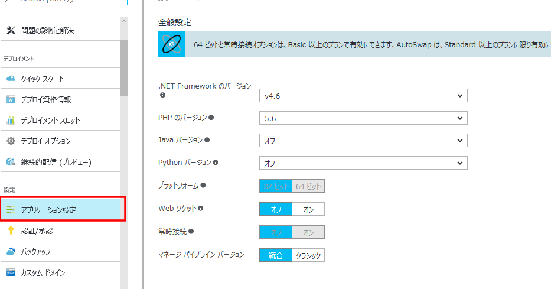  

例えば  
index.html  
/hoge  
みたいなフォルダー構成でデプロイしたときに、ホスト名/fooへアクセスするとhoge以下にアクセスさせたいときは「仮想アプリケーションとディレクトリー」を以下のようにします。    
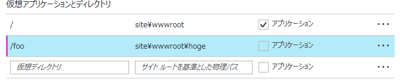  

## 4. Node.js版のWebアプリを配置してみよう  
## 5. PHPとDBを使うWebアプリを配置してみよう  
