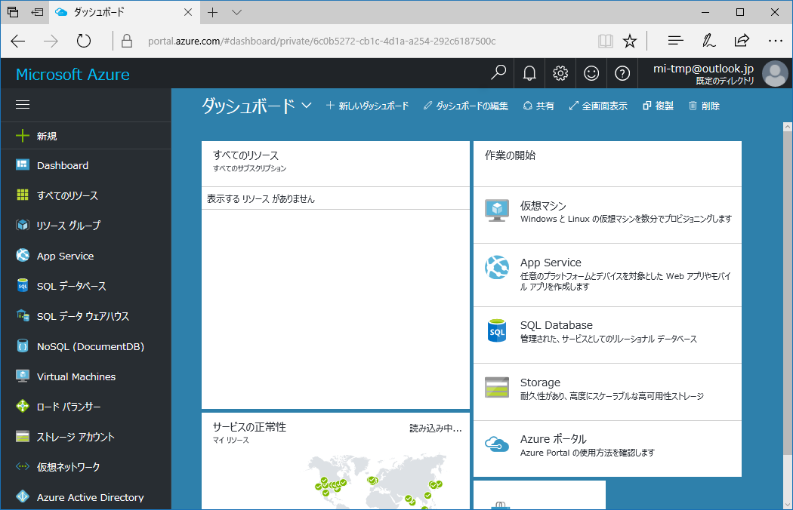
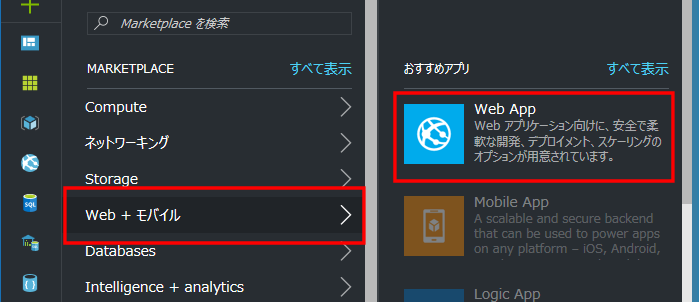
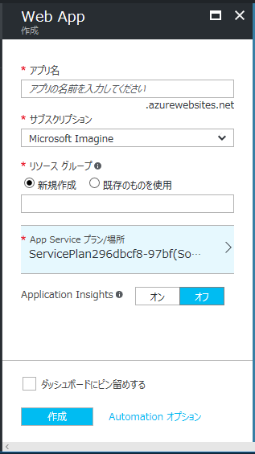
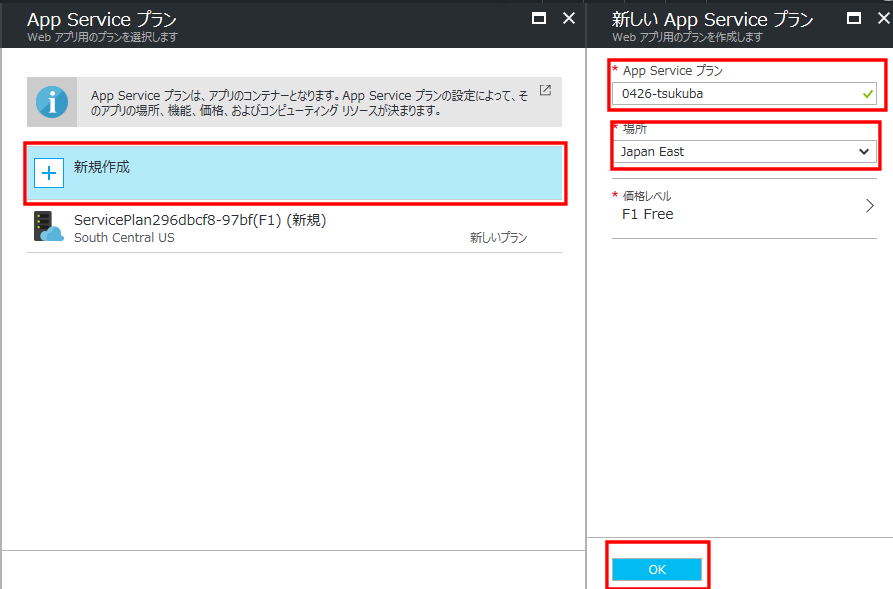
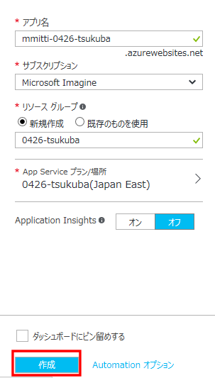
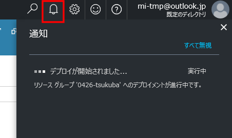
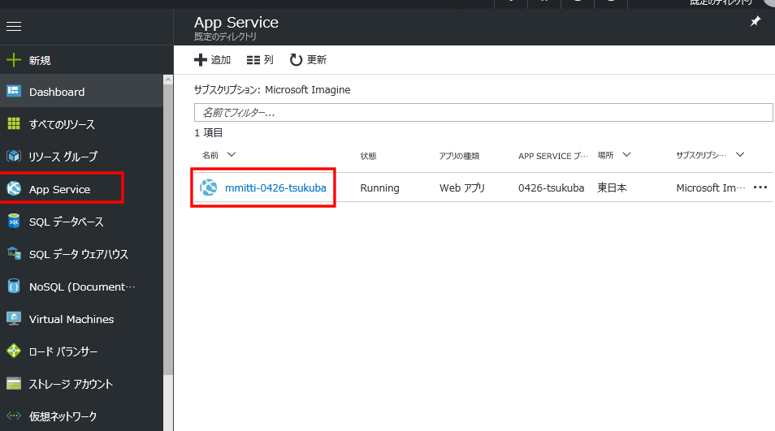
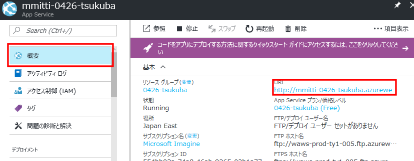
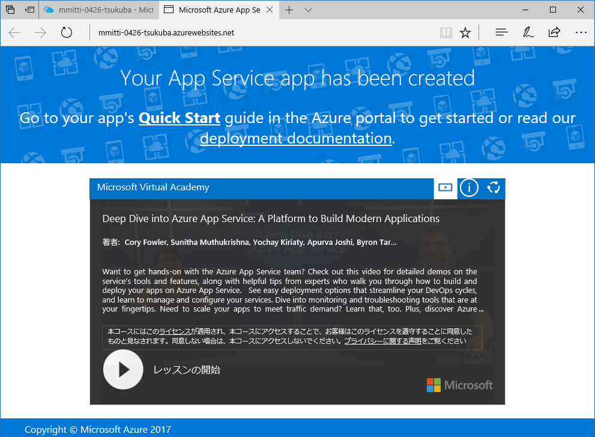

# 20170426tsukubaHandson
## フォルダー構成
* src/ Azureに配置するサンプルWebアプリ [2016年名古屋](https://github.com/mspjp/20160208AzureHandsonNagoya)で行ったハンズオンで作成したものです
* src/php/basic/ PHP動作確認用Webアプリ(HelloPHPと出るだけです)
* src/php/todo/ PHP版 TODOアプリ cookieにデータを保存する版
* src/php/todo-mysql/ PHP版 TODOアプリ DBにデータを保存する版
* src/node/basic Node.js動作確認Webアプリ(Hello Nodeと出るだけです)
* src/node/chat Node.js版 チャットアプリ

## ハンズオンの内容
0. WebAppsについて  
1. WebAppsを作成しよう  
2. PHP版のWebアプリを配置してみよう -OneDrve/DropBox/FTP/Github経由でデプロイ-  

時間があれば以下も行います  
3. Node.js版のWebアプリを配置してみよう -WebSocketの設定-  
4. PHPとDBを使うWebアプリを配置してみよう -MySQLと連携-  

## 0. AzureとWebAppsについて
### Azureとは

Microsoft社が提供するクラウド(サービスをネットワーク経由で利用する形)サービス  

仮想マシンやネットワークのインフラ、機械学習プラットフォームやストレージサービスなど様々なサービスを提供

開発者として見たクラウド(Azureに限らず)  
* インフラやプラットフォームを利用
* サーバの構築・管理などの面倒な部分はすべてお任せ  
  →開発に専念	

#### リージョン
Azureは世界各地にデータセンターを持っている(データセンターがある地域をリージョンという)  
日本は東（東京、埼玉）と西（大阪）  
リージョンごとに使える機能や料金などが異なる  
遠いリージョンだと単純に遅いので近い方がいい  

#### 料金
サービスごとに課金されるが、基本使った時間だけ  

MicrosoftImagine経由で登録した場合は無料で使える機能のみアクセス可能  
>制限を超えて使ってもあとから課金されることはないので安心  
>(ただし普通にアカウントを登録してクレジットカードと連携させて、制限をかけない場合は対象外)

### WebAppsとは  
Webサイトを簡単に公開する機能  
Webサイトを公開するのに向く  
※現在バックエンドがWindows版、Linux版がありますが、Linux版はプレビューなので
**ここではバックエンドがWindows版を対象**にします。　

以下の様なことをしたい場合は仮想マシン等を検討
* 特定のポートで待機したい
* サポートしていない言語で作りたい
* プログラムをインストルして動かしたい・ライブラリをシステムに入れる必要がある

#### 環境について(Windows版)
* 動く言語は.NET/Node.js/PHP/Java/Python  
* WindowsServerとIISで構築されている    
* Webサーバの設定は.htaccessではなくweb.configを配置  
  cakePHPなどをそのまま置くと動かない  
* コマンドを走らせたりする際はPowesShell(orCMD)  

>なお、現在Linuxインスタンスがプレビューで公開されています（Ruby対応)  
>Docker上で動くのでカスタマイズしたコンテナ上で動かすことも可能  
>※ただし4/15現在でプレビューなのでこの先どうなるかわからないです。

#### 料金プランと制限 
|プラン名|月額|アプリ数|CPU|メモリ|ストレージ|帯域制限|
|:-----:|:--:|:-----:|:--:|:---:|:-------:|:-----:|
|無料|0|10|共有 60分/日|1G|1G|165MB/日|
|共有|\1.57/時|100|共有 240分/日|0.5G|1G|無し(転送量ごとに課金)|
|Basic B1|\9.03/時|無制限|1コア|1.75G|10G|無し(転送量ごとに課金)|
|Standard S1|\12.04/時|無制限|1コア|1.75G|50G|無し(転送量ごとに課金)|
|Standard S3|\48.15/時|無制限|4コア|7G|50G|無し(転送量ごとに課金)|

アプリ数：1サーバー上で実行できるWebサイトなどの数  
CPU：60分/日は1日あたりCPU時間を60分まで利用できる  
※無料、共有プランはサーバー単位でなくアプリ単位でリソース制限・課金  
Basic,Standard,Premiumと上げていくと様々な機能が利用可能になる  

プランは任意のタイミングで変更可能（変更中数分程度ダウンタイムが発生する）  
→最初は無料プランで、必要に応じて課金することも可能

## 1. WebAppsを作成しよう
Azureのポータルサイト([http://portal.azure.com/](http://portal.azure.com/))へアクセスします

アクセスすると以下の画面になります。  
  

今回はWebサイトをホスティングするWebAppを作成するので「新規」から「Web+モバイル」、「WebApp」を選択します。  

  
  

WebAppを追加する画面が表示されます。  
  

* アプリ名  
任意です。URLになりますので他人と被らない名前にしてください。  
すでに存在する場合は が表示されます  
* サブスクリプション  
 関連付けるAzureのアカウントです。Microsoft ImaginもしくはDreamSparkが選ばれていることを確認してください。  
* リソースグループ  
新規作成を選択し、任意の名前をつけてください。  
* App Serviceプラン/場所  
AppServiceをホスティングするサーバーの場所と料金プランを選択します。  
「新規作成」を選択して「場所」を「Japan East」にすることをおすすめします。  
(価格レベルはF1 Freeのみ選択できます。なお、新規作成する場合はAppServiceプラン名に任意の名前をつけてください。)  
  

>#### リソースグループについて
>リソースグループはAzureの仮想マシン、WebApp、ネットワークなどのリソースをまとめて管理する機能です。  
>グループ化することでまとめて消したりすることが出来ます。  

  
内容を書くにして「作成」ボタンを押します。  

進捗状況は「通知」ボタンをおすことで確認できます。  
  

デプロイが完了しましたと出れば完了です。  
  

追加したWebAppにアクセスしてみましょう。  

「AppService」を選択し追加したWebAppをクリックします。  

  

「概要」に表示されるURLをクリックすることでデフォルトのページにアクセスできます。  
  

図のようなページが表示されれば完了です。  
  

## 2. PHP版のWebアプリを配置してみよう