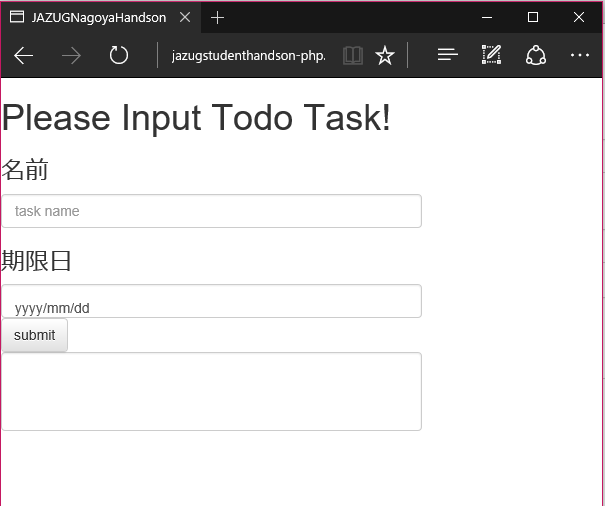
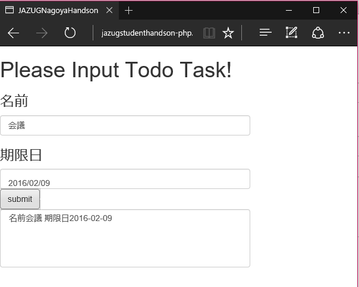
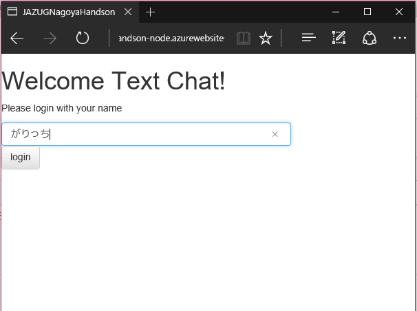
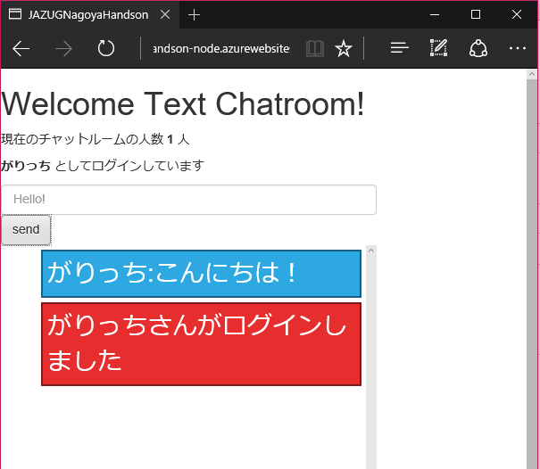

# JazugStudentHandson201602
このプロジェクトは2016/2/28の
[名古屋Azureハンズオン](https://jazug-student.doorkeeper.jp/events/38201)
で使うPHPとNode.jsのコードが入っています

## ハンズオンの資料

- [ハンズオンの準備](https://doc.co/ADYWUk)
- [ハンズオン資料](https://doc.co/2QpEsk)

## PHPハンズオン
PHPで簡単なTodoを記録するアプリです

[デモサイト](http://jazugstudenthandson-php.azurewebsites.net/)

タスクの名前と日付を指定してsubmitボタンを押すと下のリストに記録されます

## Node.jsハンズオン
Node.jsとWebSocketを使ったリアルタイムチャットアプリです

[デモサイト](http://jazugstudenthandson-node.azurewebsites.net/)

名前を入れてloginボタンを押すとチャットルームにログインします

発言を入れてsendボタンを押すと発言がチャットにリアルタイムに流れます

