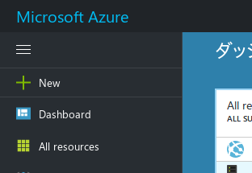
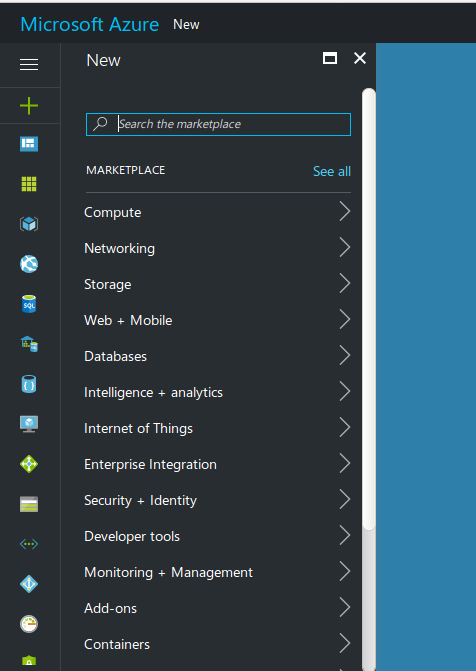
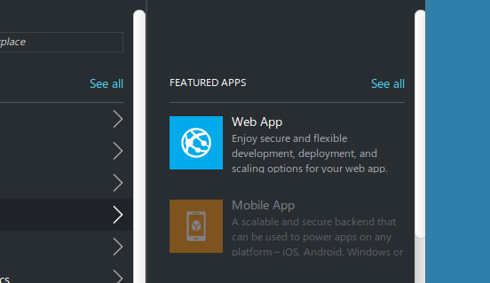
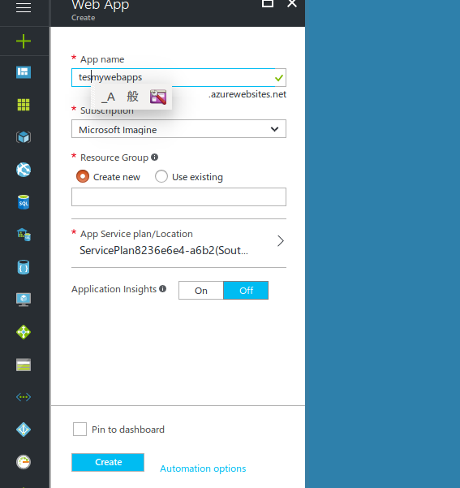
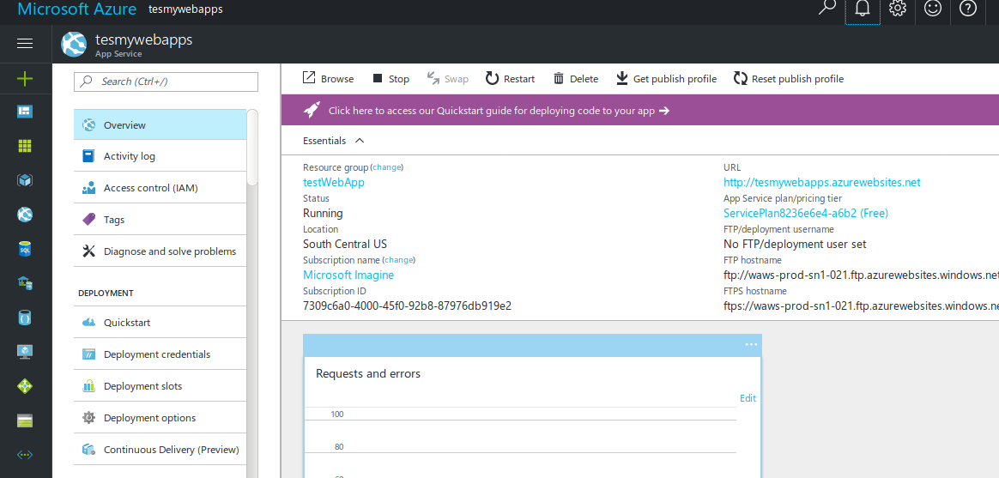
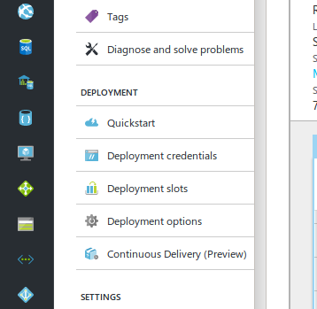
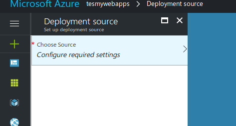
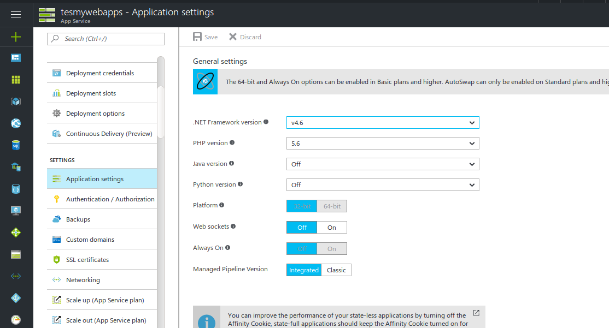
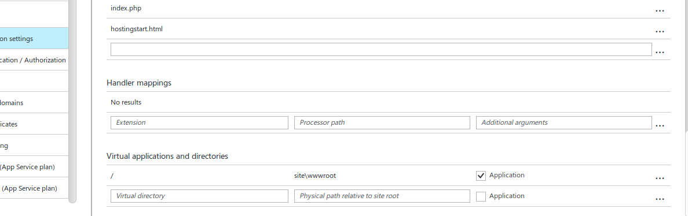

# PythonでWebApps 
## なぜPythonを選んだか
* 個人的には、C++とCが好みだが、Webアプリを作るとなると少し難しそうである。  
* Pythonはかんたん！
* データサイエンス・機械学習系につよく、これらの資産を組み込みやすい。

## Pythonでのwebフレームワーク  
* Django  
[(MS公式資料) djangoを使用した Web アプリの作成](https://docs.microsoft.com/ja-jp/azure/app-service-web/web-sites-python-create-deploy-django-app)  
PythonのWebフレームワークの中では、最も人気の高いフレームワークの１つ。様々な機能が備わっている。  

* Bottle  
[(MS公式資料) Bottleを使用した Web アプリの作成](https://docs.microsoft.com/ja-jp/azure/app-service-web/web-sites-python-create-deploy-bottle-app)  
最も軽量なPythonのWebフレームワーク。一つのファイルで構成可能。  

* Flask  
[(MS公式資料) Flaskを使用した Web アプリの作成]((https://docs.microsoft.com/ja-jp/azure/app-service-web/web-sites-python-create-deploy-flask-app)  
軽量なフレームワークの中では、最も人気があるWebフレームワーク。  

# Flaskをローカル環境で使用してみる  
ローカルでの環境の構築。
Pythonは環境構築で失敗しがちだが、Dockerを使えば問題ない。  

## Dockerとは
仮想化のためのオープンソースソフトウェア。  
「開発環境を仮想化する。」ことで、常に綺麗な環境を使用する(テストできる)ことができる。  
Pythonの場合、docker以外にもpyenvやvirtualenvという環境をクリーンで使うためのツールが存在する。  
どちらも使えるようになっておくと便利である。  

## Dockerを自分のPCにInstallする
Mac, Linux, Windowsすべてでinstall可能。  
[Docker Install Link](https://www.docker.com/community-edition#/download)  

## Dockerでテスト環境を構築する
Docker ImageをDockerHub上から、ダウンロードすることができる。  
これを走らせてtest環境とする。  
今回は[DockerHub Python Official Repository](https://hub.docker.com/_/python/)より、Python:3.4というDocker Imageを選んだ。  
Ubuntuベースだが、すべてのOSで使用可能である。  
HostがWindowsの場合、Windows Serverベースのものが使用可能となり、今回使用するAzure上の環境と同様になる。
```
docker pull python:3.4
```
(環境によって、dockerコマンドは管理者権限で行う必要がある。)  
現在PCにpullされているDocker Imageはつぎのコマンドで確認できる。  
```
docker images
```

## ディレクトリの構成
```
DockerPythonWebapps
├── README.md
├── apps
│   └── hello-flask.py
└── image
    ├── Dockerfile
    └── Makefile
```

## Docker Imageを作る方法
自分でDocker Imageを作るには、2つ方法がある。
* Docker Commit  
走らせたDockerコンテナ上で環境を構築し、そのコンテナをImageとして保存する。
* Docker Build  
環境構築コマンドを記したDockerfileを書き、Docker BuildしてImageを作成する。  

## Dockerfileを書いてみる
以下のソースがDockerfileとしてimageディレクトリ配下にある。  
```
From python:3.4 

USER root
RUN apt-get update && apt-get install -y vim
RUN pip install --upgrade pip
RUN pip install flask && pip install flask --upgrade
RUN cd && mkdir apps
```

## Docker ImageをBuildする
imageディレクトリ内で次のコマンドを実行する。  
--tagでImageに名前をつけることができる。  
```
docker build --tag=my/webapps-flask .
```

## Dockerコンテナを実際に走らせてみる
Flaskのテストをするために、Docker Runをさせてみる。  
PortをHostPCと結びつけることで、ブラウザから動作確認する。今回は5000番同士を結びつける。  
また、apps以下のディレクトリをHostPCと共有することで開発HostPCでもプログラミングできるようにする。  
```
docker run -it -v `pwd`/apps:/root/apps --name mywebapps -p 5000:5000 my/webapps-flask /bin/bash
```

## FlaskのsampleをDocker上で走らせてみる
Dockerコンテナ上からappsディレクトリ以下にアクセスするために、apps以下のパーミッションを設定する。  
```
chmod +rx apps/
```
apps以下に配置された、hello-flask.pyを実行する。  
```
python3 hello-flask.py
```

## ブラウザから動作確認する
ブラウザのURL入力部に以下のURLをうつ。  
127.0.0.1はlocalhostでもよい。  
```
http://127.0.0.1:5000
```

## Dockerコンテナの停止と、削除
上記のコマンドでdocker runさせるとき、コンテナの名前で以前作ったものとコンフリクトを起こすことがある。  
これは使い終わったDockeコンテナをきちんと削除することで解決する。  
Dockerコンテナの停止
```
docker stop mywebapps
```
Dockerコンテナの削除
```
docker rm mywebapps
```

# PythonでのWebアプリをAzure上にデプロイする
Azure portalにSign inする。  
+Newをクリックする。  
  
Web+Mobileをクリックする。  
  
Web+Mobileをクリックする。  
  
App nameを入力。これはURLになるので、注意。  
SubscriptionはMicrosoft Imagine。  
Resource Groupは、適当に新しい名前をつける。  
Pin to dashboardにチェックを入れ、createをクリック。  
  
少し時間がかかるが、つぎのような画面となる。  
  
デプロイの設定をクリック  
  
ChooseSourceをクリック  
デプロイ環境はなんでもよい。  
  
ApplicationSettingをクリック  
Python versionを3.4に設定する。  
  
下にスクロールすると、VirtualApplications and directortyと書いてある。  
POSTやGETをする場合はここを設定する。  
  

# 参考資料

* [Azure App Service Web Apps による Python の構成](https://docs.microsoft.com/ja-jp/azure/app-service-web/web-sites-python-configure)
* [PythonのWebフレームワーク4種比較](http://programming-study.com/technology/python-framework/)
* [(MS公式資料) djangoを使用した Web アプリの作成](https://docs.microsoft.com/ja-jp/azure/app-service-web/web-sites-python-create-deploy-django-app)  
* [(MS公式資料) Bottleを使用した Web アプリの作成](https://docs.microsoft.com/ja-jp/azure/app-service-web/web-sites-python-create-deploy-bottle-app)  
* [(MS公式資料) Flaskを使用した Web アプリの作成](https://docs.microsoft.com/ja-jp/azure/app-service-web/web-sites-python-create-deploy-flask-app)  
* [DockerHub Python Official Repository](https://hub.docker.com/_/python/)


